# SmartHealth - Edge Intelligence Component 🩺⚡


## 📖 Overview

This repository houses the **Edge Computing Module** of the SmartHealth monitoring system. Designed to operate close to the data source (the patient), its primary role is to ingest real-time ECG sensor data, perform immediate statistical analysis to detect cardiac anomalies, and securely transmit critical alerts to the Cloud Backend.

A key feature of this module is its **network resilience**: it ensures zero data loss by buffering alerts locally when the cloud connection is unstable and synchronizing them automatically upon reconnection.

---

## ✨ Key Features

### 🧠 Real-Time Anomaly Detection
Implements a statistical **Sliding Window algorithm**. It calculates the running mean ($\mu$) and standard deviation ($\sigma$) of the last 5 seconds of ECG readings to identify deviations in real-time.

### 🛡️ Offline Resilience & Data Buffering
Meets critical medical reliability standards. If the Cloud Backend is unreachable, the Edge module automatically switches to **Offline Mode**, queuing encrypted alert data locally until connectivity is restored.

### 🔄 ECG Simulation Mode
Includes a robust simulation engine that streams real-world medical data from the **MIT-BIH Arrhythmia Database** (CSV format), mimicking a live sensor feed for testing and validation.

### 🚀 Modern Tech Stack
Built entirely with **Python 3.14.2**, leveraging the latest language performance improvements and modern type-hinting capabilities for robust code.

---

## ⚙️ How It Works (Architecture Flow)

```mermaid
graph TD
    A[ECG Sensor Data / CSV Sim] -->|Raw Stream| B(Pre-processing & Noise Filtering);
    B -->|Clean Value| C{Sliding Window Alg.};
    C -->|Status: Normal| D[Continue Monitoring];
    C -- "|Value - μ| > k*σ" --> E[Anomaly Detected!];
    E --> F{Network Check};
    F -->|Online| G[POST Alert to Cloud API];
    F -->|Offline| H[Buffer Alert Locally];
    H -->|Connection Restored| G;

```



---

## 🛠️ Getting Started

Follow these steps to set up and run the Edge module locally.

### Prerequisites

* **Python 3.14** or higher installed.
* Git installed.

### Installation

1. **Clone the repository:**
```bash
git clone https://github.com/GrossmanOri/SmartHealth_Edge.git
cd SmartHealth_Edge

```


2. **Set up a Virtual Environment (Recommended):**
```bash
python3 -m venv venv
# On macOS/Linux:
source venv/bin/activate
# On Windows:
.\venv\Scripts\activate

```


3. **Install dependencies:**
```bash
pip install pandas requests numpy

```


4. **Verify Data Source:**
Ensure that the `100_ekg.csv` file exists in the `data/` directory.

---

## ▶️ Running the Simulation

To start the real-time monitoring simulation, simply run the main script:

```bash
python main.py

```

**What to expect in the terminal:**

* You will see a stream of processed ECG values every second.
* When an anomaly is detected, an `(!) ALERT` message will appear.
* If the cloud server is not running locally on port 5000, you will see `OFFLINE: Event buffered` messages, demonstrating the resilience feature.

---

## 🧰 Tech Stack

* **Language:** Python 3.14.2
* **Data Processing:** Pandas, NumPy
* **API Communication:** Requests (HTTP/REST)
* **Development IDE:** JetBrains PyCharm

---

## 👤 Author

**Ori Grossman** - Software Engineering Student, Shenkar.
